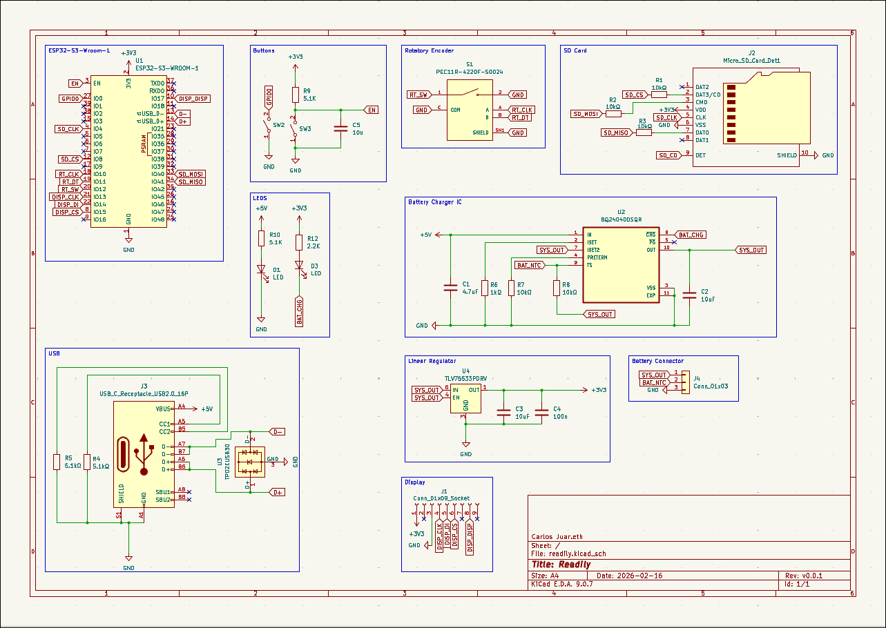

# READILY

```text
██████╗ ███████╗ █████╗ ██████╗ ██╗██╗  ██╗   ██╗
██╔══██╗██╔════╝██╔══██╗██╔══██╗██║██║  ╚██╗ ██╔╝
██████╔╝█████╗  ███████║██║  ██║██║██║   ╚████╔╝
██╔══██╗██╔══╝  ██╔══██║██║  ██║██║██║    ╚██╔╝
██║  ██║███████╗██║  ██║██████╔╝██║███████╗██║
╚═╝  ╚═╝╚══════╝╚═╝  ╚═╝╚═════╝ ╚═╝╚══════╝╚═╝
```

An embedded Rust RSVP reader for ESP32-S3 + Sharp memory LCD.

`readily` aims to feel like a product: fast word presentation, clean UI, animated navigation, SD EPUB loading, and persistent settings.

## What It Does Today

- Library-style home screen with animated cover cards
- Reading flow with 3-second countdown
- RSVP center-anchor word rendering
- Pause overlay + chapter/paragraph navigation selector
- Adjustable typography/style (font, size, invert mode, WPM)
- Flash-backed persisted settings on ESP32-S3
- Rotary encoder input (rotate + press)
- SD `/BOOKS` scan for EPUB files at boot
- Initial text-chunk probe + streaming refill while reading
- EPUB cover thumbnails in library cards

## Architecture

```text
readily (workspace root)
├─ src/bin/main.rs                # board wiring + main loop + SD/Wi-Fi runtime orchestration
├─ crates/readily-core            # app state machine, traits, screen view models
├─ crates/readily-hal-esp32s3     # ESP32-S3 input/render/storage/display adapters
└─ crates/ls027b7dh01             # Sharp LS027 protocol + framebuffer driver
```

Design rule:
- Core logic is hardware-independent.
- HAL crates adapt hardware to core traits.

## Hardware Wiring (Current Firmware Defaults)

### Full Board Schematic



KiCad project files live under `kicad/readily/` (main schematic: `kicad/readily/readily.kicad_sch`).

### Display (Sharp LS027 breakout)

| Breakout Pin | Firmware Signal | ESP32-S3 GPIO |
|---|---|---|
| `CLK` | SPI SCK | `GPIO13` |
| `DI` | SPI MOSI | `GPIO14` |
| `CS` | `SCS` | `GPIO15` |
| `DISP` | display enable | `GPIO7` |
| `EMD` | `EXTCOMIN` | `GPIO9` |
| `GND` | ground | `GND` |
| `3V` | power | `3V3` |

### SD Card SPI

| SD Signal | ESP32-S3 GPIO |
|---|---|
| `CS` | `GPIO8` |
| `SCK` | `GPIO4` |
| `MOSI` | `GPIO40` |
| `MISO` | `GPIO41` |

### Rotary Encoder

| Encoder Pin | ESP32-S3 GPIO |
|---|---|
| `CLK` | `GPIO10` |
| `DT`  | `GPIO11` |
| `SW`  | `GPIO12` |

## Controls

- Home: rotate to select book/settings, press to enter
- Reading:
  - single press: pause/resume
  - double press: exit back to home
- Pause:
  - rotate: browse chapter/paragraph selectors
  - press: confirm selection / jump

## Build, Flash, Monitor

The project is configured with:
- toolchain channel: `esp`
- default target: `xtensa-esp32s3-none-elf`
- runner: `espflash flash --monitor --chip esp32s3`

So this is enough to flash and open serial monitor:

```bash
cargo run --release
```

## Developer Checks

```bash
cargo fmt --all
cargo check --offline
cargo clippy --offline --workspace --lib
```

Note:
- `cargo test --workspace` may fail under the default embedded target context.

## Key Runtime Defaults

- WPM: `230` (range `80..600`)
- Dot pause: `240 ms`
- Comma pause: `240 ms`
- Countdown: `3` seconds
- Settings save debounce: `1500 ms`
- SD stream chunk size: `480 bytes`

## Content Backend (Current)

`readily_core::content::sd_stub::FakeSdCatalogSource` is still the core app-facing content model, but it is now fed by real SD probing logic at runtime.

Boot/runtime flow:
- Scan `/BOOKS` for EPUB files (`.epub` / `.epu`)
- Load title list + `has_cover` metadata
- Probe and apply first text chunk per book
- Probe and decode cover thumbnails
- Stream additional chunks on demand while reading
- Advance across chapter resources when current one ends
- Fallback to built-in in-memory content if SD probing fails

## EPUB Text Parsing Notes

- UTF-8 decoding is chunk-safe (split multibyte codepoints are preserved across refills)
- Common HTML entities are decoded (`&amp;`, `&rsquo;`, `&aacute;`, etc.)
- Common cp1252-like punctuation/accents are normalized as fallback
- Renderer glyph normalization maps typographic quotes/dashes to ASCII equivalents for consistent serif rendering

## Cover Support and Limits

Supported:
- `image/png` / `.png` (non-interlaced decode path)
- `image/jpeg` / `.jpg` / `.jpeg` when compatible with ESP32 TJPGD path (baseline-style JPEGs)
- `image/x-portable-bitmap` / `.pbm`
- Cover fallback heuristics when explicit metadata is weak/missing

Known limits:
- Progressive/unsupported JPEGs fail decode (you will see `jd_prepare status=8` / `fmt3_progressive_or_unsupported` in logs)
- Some EPUBs have no cover resource at all (`no_cover_resource`)

## Operational Notes (From Field Testing)

- `WARN - Invalid FAT32 FSInfo sector; ... Bad lead signature on InfoSector` is commonly non-fatal if scans continue successfully.
- `wifi connect failed: Disconnected` + `esp_wifi_internal_tx` warnings are expected when AP is unavailable and do not block local reading.
- Chapter jumps in large EPUBs can be slower because seek probes may walk chapter resources sequentially.
- During chapter navigation, placeholder entries can appear before target chapter chunks are loaded.
- Standalone `.txt` files in `/BOOKS` are not currently exposed as top-level library books (TXT handling is currently through EPUB internals/manifest media).

## Near-Term Roadmap

- Faster random chapter seek (reduce linear probe cost)
- Better handling for progressive JPEG covers (or conversion fallback)
- Optional pre-indexing/warm caching for smoother chapter/paragraph navigation
- Standalone TXT content source (non-EPUB files) behind existing core traits
